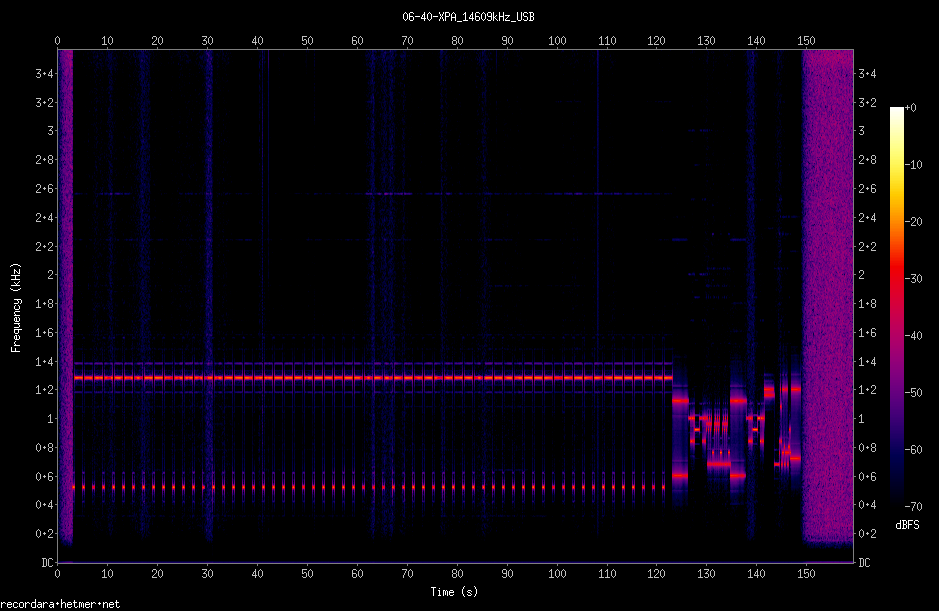

recordara
=========

_this is the old v0.1 of recordara - after "MECHANIZM" & "Calendario" are ready it will be replaced in the master branch_

WebSDR Automatic Recorder

main workflow
1. load up priyom calendar
2. spawn a grabber process per each broadcasast
3. grabber flushes out 2 files, one with squelch on
4. recordara calculates probable EOF, trims the file, encodes, writes a spectrogram & hands it off to S3

code quality: working PoC

### grab.js standalone

(example)

    /usr/bin/nodejs /opt/recordara/grab.js 19252 /opt/recordara/output/2017-07-21/11-00-E07_19252kHz_USB 960000 0.15 3.7
